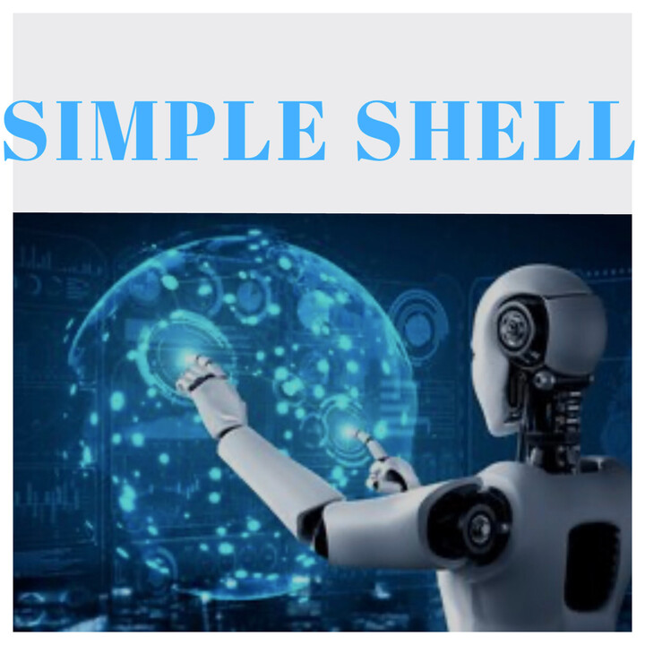

#### [document simple shell](vscode-local:/c%3A/Users/selve/Downloads/simple%20shell%20noor%20mina.pdf)

# Simple Shell
A basic UNIX command interpreter written in C

## Description
This project is a simple implementation of a UNIX shell. It allows the execution of basic commands and offers features such as process management and basic input/output redirection

## Features
Execution of simple commands
Path handling (PATH)
Child process management
Basic input/output redirection
Signal handling (Ctrl+C)

## Compilation
### To compile the shell, use the following command
gcc -Wall -Werror -Wextra -pedantic -std=gnu89 *.c -o hsh

## Usage
### Launch the shell in interactive mode
./hsh

### Or use it in non-interactive mode
echo "/bin/ls" | ./hsh

## Examples
$ ./hsh
/bin/ls
hsh main.c shell.c
exit
$

## Authors
MINS2405
ni-mdj

## License
This project is licensed under the MIT License. See the LICENSE file for details

